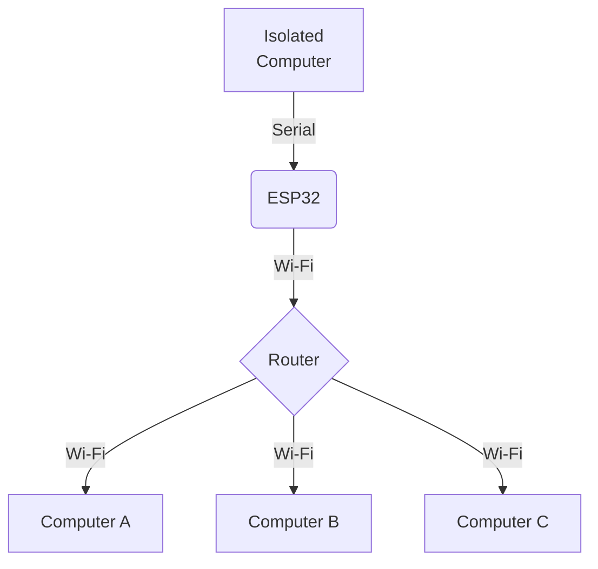

# ESP32 ROS Companion
Tutorial on making an ESP32 ROS Companion, that uses serial communication to read values from an isolated computer and sends to the ROS network via wifi for a ROS enabled computer to get access.


# Software setup and requirements
* ROS Noetic
* ESP32 Arduino framework
* `rosserial` package
* `ros_lib` Arduino library
* python for serial communication (or anything that talks via serial)

# Hardware setup
* Computer as ROS Master
* Isolated computer 
* ESP32 dev board and USB cable
* Wi-Fi router

# Use case

The code provided in this repo can be used to test a simple application. The objective is to iteratively read a 6DOF pose data on a Python code, sending it through serial and then encapsulating it as a PoseStamped message to a topic in the ROS network via Wi-Fi. The following chart shows the flow of data.



## On the isolated computer

```bash
python3 send_serial_esp32.py
```

## On the ROS computer

```bash
roscore
```

```bash
rosrun rosserial_python serial_node.py tcp
```

## On the ESP32

Compile and upload the project [serial2roswifi](serial2roswifi/serial2roswifi.ino).